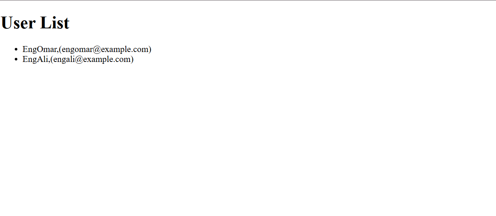

  ## React JS Exercise 10
  
  ***
  
  ## Developer Name: Eng Abdirahman Ai
  
  ***
  
  ## Group A
  
  ***
  
  [GitHub Link](https://github.com/engai2025/React-Exercise-10)
  
  ***
  
  ## Code
  
  ### App.jsx
  
  ```jsx
  // App.jsx Code
 import UserList from "./UserList";
 function App(){
  return(
    <>
      <UserList />
    </>
  )
 }

 export default App;
  ```
  
  ### UserList.jsx
  
  ```jsx
  // UserList.jsx code
 
 const UserList =()=>{
    const users = [
        {id: 1 , name: "EngOmar", email: "engomar@gmail.com"},
        {id: 2 , name: "EngAli", email: "engali@gmail.com"}
    ]
    return(
<div>
    <h1>User List</h1>
       <ul>
        {
            users.map(user =>(
                <li key={user.id}>{user.name},({user.email})</li>
            ))
        }
       </ul>
</div>
    )
}
export default UserList;


  ```
  
   
  
   
  
  ## Output
  
  ***
 
  

 
 
  
  ***
  
  ## Programming Language Used
  
  ***
  
  | Programming Language | Framework | Database |
  |:--------------------|:----------|:---------|
  | React JS            | 0         | 0        |
  
  ***
  
  ## Task
  
  - [x] Done
  
  